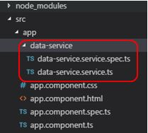
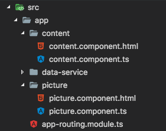

# Concept


## Define a data model

在開發過程，面對許多既定資料內容，我們可以定義 data model 來描述資料，也就是一個 class

舉例來說，我們會有很多從後端傳來的 key-value 資料，這時候為了方便操作資料，就可以定義一個 model: MasterData.ts

```ts
/* masterData.ts */

export class MasterData {
  key: string;
  value: string;
}

```

這樣我們在 component 之中就可以來使用它：

```ts
import { Component } from '@angular/core';

// 從同層目錄結構底下 import MasterData
import { MasterData } from './masterData';

// 用這個 model 來宣告一個新的資料陣列
const MASTERS: MasterData[] = [
  { key: 'Hello1', value: 'World1' },
  { key: 'Hello2', value: 'World2' },
  { key: 'Hello3', value: 'World3' },
];

@Component({
  selector: 'my-app',
  templateUrl: './app.component.html',
  styleUrls: [ './app.component.css' ],
})
export class AppComponent {
  title = 'Hello World';

  // 就可以在這裡使用
  datas = MASTERS;
}

```


## Mutiple Component

在 Angular 之中，可以建立各種不同的客製化 component 來給其他 component 使用

1. 建立 ui.select.component.ts 與對應的 .html

```ts
/* ui.select.component.ts */
import { Component, Input } from '@angular/core';
import { MasterData } from './masterData';

@Component({
  selector: 'ui-select',
  templateUrl: './ui.select.component.html',
})
export class UiSelectComponent {
  // 這裡有一個 input 接口，讓外界可以傳資料進來這個 component
  @Input() data: MasterData[];
}
```

```html
<!-- ui.select.component.html -->
<select>
  <option *ngFor="let d of data"
    id="{{d.key}}">
    {{d.value}}
  </option>
</select>

```

同樣的，要記得去 module 中 declaration 宣告 UiSelectComponent 才可以使用

2. 在 app.component 之中就可以來使用這個客製化的 UiSelectComponent

```ts
/* app.component.ts */
import { Component } from '@angular/core';
import { MasterData } from './masterData';

@Component({
  selector: 'app-root',
  templateUrl: './app.component.html',
  styleUrls: ['./app.component.css']
})

export class AppComponent {
    // 利用我們定義好的 MasterData model 來宣告變數
    bindingData: MasterData[];
    constructor() {
      // 先假造資料
      this.bindingData = [
        {key: 'A1', value: 'valueA'},
        {key: 'B1', value: 'valueB'}
      ]
    }
}
```

```html
<!-- app.component.html-->
<ui-select [data]="bindingData">
```


## Service

在 Angular 中，我們可以將處理資料的邏輯抽出來寫到一個 Servcie 之中，這樣可以讓多個 Component 共用，也可以使得架構更清楚明確，達到關注點分離、程式更加容易維護!


### Create a Service

使用 Cli 幫我們自動建立 Service

```sh
ng g s DataService
```

這樣就會自動幫你在 src/app/data-servcie 底下建立好一個 data-service.service.ts



Service 會有一個 @Injectable 的 decorator，讓其他 component 未來要使用可以用注入的方式來使用

```ts
/* data-service.service.ts 部分內容 */
import { Injectable } from '@angular/core';

@Injectable()
export class DataServiceService {
  constructor() { }
}
```

### Set service into providers

接著一樣要到 app.module.ts 的 @NgModule: providers 加入這個 service，這樣其他的 component 才能使用到它

```ts
/* app.module.ts 部分內容 */
...
import { DataServiceService } from './data-service/data-service.service';
...
@NgModule({
  ...
  providers: [DataServiceService],
  ...
})
export class AppModule { }
```


### Use service in components

最後，在 component 之中，只要 import 這個 service，並在 constructor 帶入參數之後就可以使用囉

```ts
/* app.component.ts 部分內容 */
...
import { DataServiceService } from './data-service/data-service.service';
...
export class AppComponent implements OnInit {
    constructor(private service: DataServiceService) {}

    ngOnInit(): void {
      // 假如有一個 getData() 的 function 就可以這樣使用
      this.service.getData(); 
    }

```


## Routing

當一個 webapp 有多張不同頁面，而且我們又想讓他保持 SPA 的時候，就必須使用到 Anguler 的 Router 了

我們可以利用 router 來替頁面在不同 url 的時候，渲染不同的 component

舉例來說，我們建立兩個不同長相的 component: content / picture，和一個 router 的檔案



### 建立一個 router module 

首先，我們建立一個 router module 檔案，可以任意命名，但一樣記得最後要去 app.module.ts 宣告。接著必須在 router module 裡面 import RouterModule and Routers 並且定義 routing rule。

```ts
/* app-routing.module.ts */

import { NgModule } from '@angular/core';

// import RouterModule and Routers
import { RouterModule, Routes } from '@angular/router';

// import 兩個不同長相的 component
import {ContentComponent} from './content/content.component';
import {PictureComponent} from './picture/picture.component';

// 這是 routing 的規則
const routes: Routes = [
  // 當 root path 的時候自動導到 /content
  { path: '', redirectTo: '/content', pathMatch: 'full' },
  // 當 host:port/picture 時，使用 PictureComponent 渲染頁面
  { path: 'picture', component: PictureComponent },
  // 當 host:port/content 時，使用 ContentComponent 渲染頁面
  { path: 'content', component: ContentComponent }
];

// 在這裡定義 import & export
@NgModule({
  imports: [ RouterModule.forRoot(routes) ],
  exports: [ RouterModule ]
})
export class AppRoutingModule {}

```

一樣到 app.module.ts 定義

```ts
/* app.module.ts 部分內容 */
...
import { AppRoutingModule } from './app-routing.module';
...
  imports: [
    ...
    AppRoutingModule
  ],
...
```

### 在 component 中使用

最後一步，要到使用 router 的 component 來插入 router 的 derivative
ex: 我們將兩個 child component (content & picture) 放入 parent component (app.component)

```html
<!-- app.component.html -->
<router-outlet></router-outlet>
```

如此一來，就可以透過 url 來切換頁面了！


### Next:  [04 Interaction with Components]

[04 Interaction with Components]: <04.interaction-with-component.md>