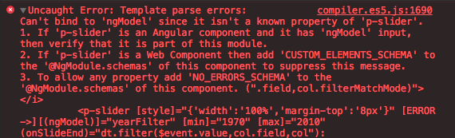

# Common Issues

在開發中常常會遇到一些未知的問題，這裡主要做個紀錄

### Can't bind to 'ngModel'

使用外部 component 時最常發生的問題，常發生在你使用了 ngModel 到這個外部 component 或是自己寫的 component 上的時候。
會在 browser console 上顯示：
Uncaught Error: Template parse errors:
Can't bind to 'ngModel' since it isn't a known property of XXX



這時候需要在 app.module.ts 去 import

```ts
import { FormsModule } from '@angular/forms';

[...]

@NgModule({
  imports: [
    [...]
    FormsModule
  ],
  [...]
})
```