# CSS Flexbox

## Basic 

Flex 意為彈性的布局，舉例來說:

```css
.box {
    display: flex;
}

.box-inline {
    display: inline-flex;
}
```

外層會有一個 container (flex-container)，以及內部的 items (flex-item)

我們先將 container 設為一個 flex

```html
<div class="container">
    <div class="item item1">1</div>
    <div class="item item2">2</div>
    <div class="item item3">3</div>
    <div class="item item4">4</div>
</div>
```
css class setting

```css
.container {
    display: flex;
}
.item {
    border:1px solid #000;
    height: 60px;
    text-align: center;
    line-height: 50px;
}
.item1{
    width: 100px;
    background: #FF8888;
}
.item2{
    width: 200px;
    background: #9999FF;
}
.item3{
    width: 300px;
    background: #33FFAA;
}
.item4{
    width: 400px;
    background: #888888;
}
```

flex 會將畫面依照 item 的比例均分

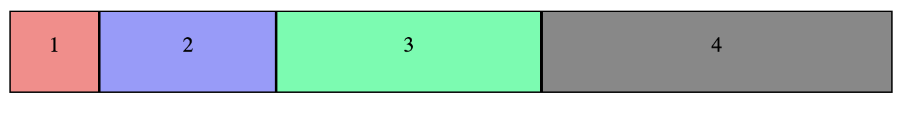

但假如每個 item 沒有給予寬度，就會使用內容長度而已

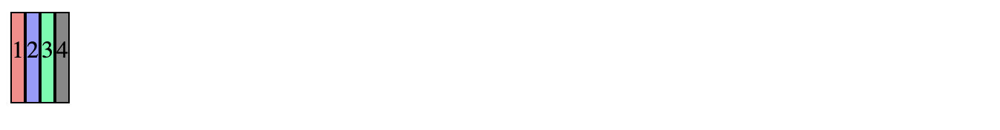

## 外層 container 屬性

* flex-direction
* flex-wrap
* flex-flow
* justify-content
* align-items

### flex-direction
 
<code>flex-direction</code> 是用來控制主軸的方向，有四種設定可以調整，預設會是 <code>row</code> ，會是剛剛看到的排列方式。

```css
.container {
    flex-direction: row | row-reverse | column | column-reverse | inherit;
}
```

<code>flex-direction: row-reverse</code>

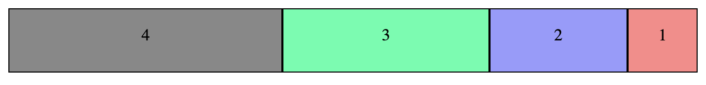

<code>flex-direction: column</code>

使用 column 的方式排列，每個 item 會是本來定義的大小

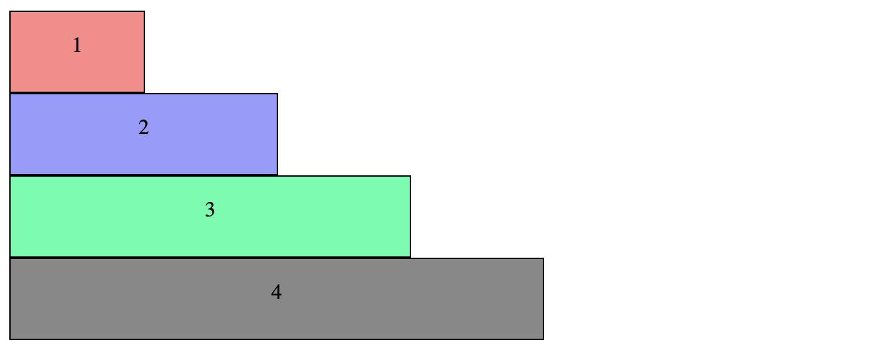

假如沒有定義寬度，那預設就會整個撐滿


<code>flex-direction: column-reverse</code>

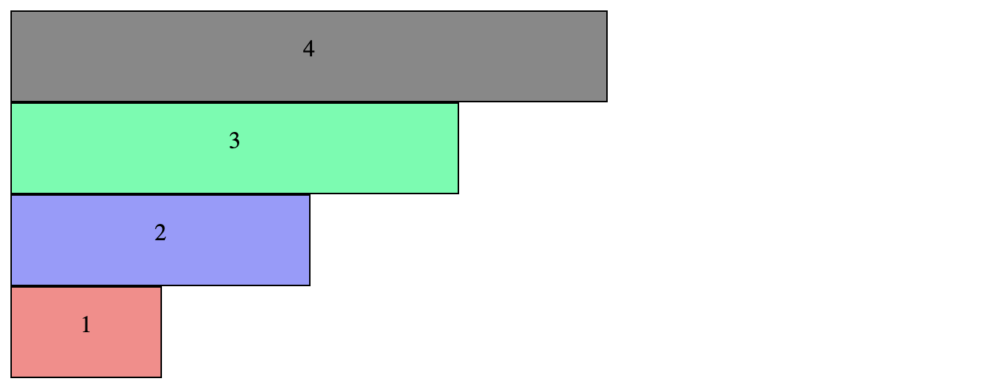


### flex-wrap

這個屬性用來設定超出範圍的時候，需不需要換行。預設會是 <code>nowrap</code> ，這在最預設 row 的情況下會直接平分寬度，就不會是實際 item 的寬度。

```css
.container {
    flex-wrap: nowrap | wrap | wrap-reverse | inherit;
}
```

先以 <code>flex-direction: row</code> 為範例

<code>flex-wrap: nowrap</code>


<code>flex-wrap: wrap</code>

使用 wrap 的時候，會使用 item 實際的寬度，當超出範圍就會往下換行。

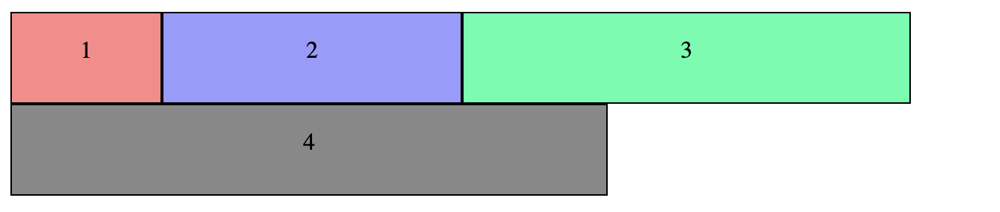

<code>flex-wrap: wrap-reverse</code>

一樣是會使用本來寬度，只是當超出範圍的時候會往"上"換行。

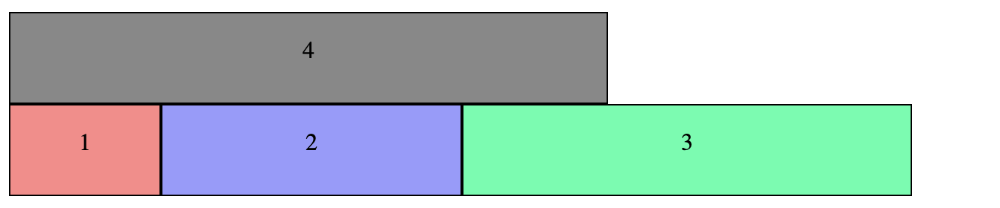

### flex-flow

即為 <code>flex-direction</code> + <code>flex-wrap</code>

用法：

```css
.container {
    flex-flow: {flex-direction} {flex-wrap};
}
```
以前面的例子舉例

```css
.container {
    display: flex;
    flex-direction: row;
    flex-wrap: wrap;
}
```

就可以寫成

```css
.container {
    display: flex;
    flex-flow: row wrap;
}
```

### justify-content

這個屬性，會是根據主軸 <code>flex-direction</code> 來做水平的對齊，因此如果 direction: column 就會變成是做垂直的對齊。

有以下幾種設定可以使用

```css
.container {
    justify-content: flex-start | flex-end | center | space-between | space-around;
}
```

在以下的例子，先把 item4 拿掉，讓剩下三個 item 加總寬度不滿螢幕寬

<code>justify-content: flex-start</code>

flex-start 是預設值，item 會從左到右開始排列

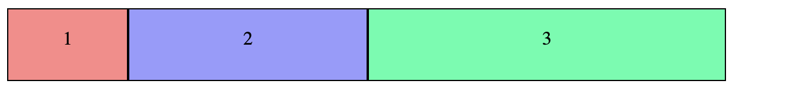

<code>justify-content: flex-end</code>

flex-end 也就是會貼齊右邊

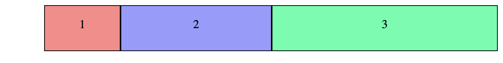

<code>justify-content: center</code>

center 也就是置中對齊

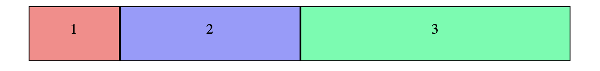

所以只要當 direction 為 column 的時候，就可以輕易做到垂直置中對齊。注意的是這裡的 container 必須要有 height (250px)

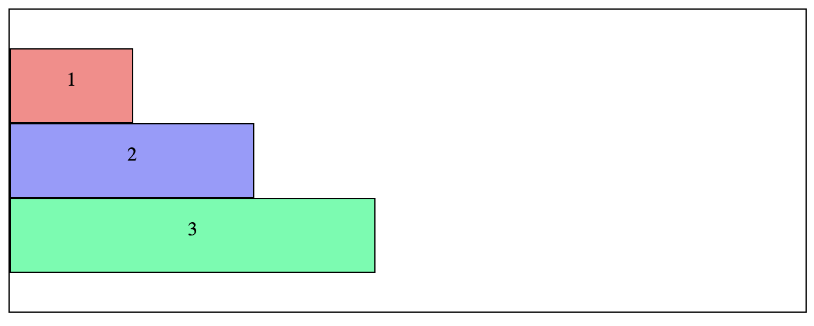

<code>justify-content: space-between </code>

代表平均在 item 中間有 space 隔開

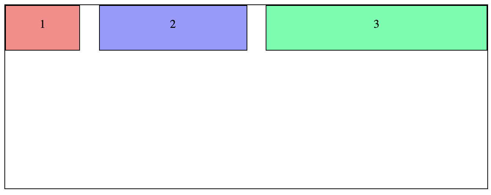

相對的如果是 direction 為 column 時，一樣能垂直平分

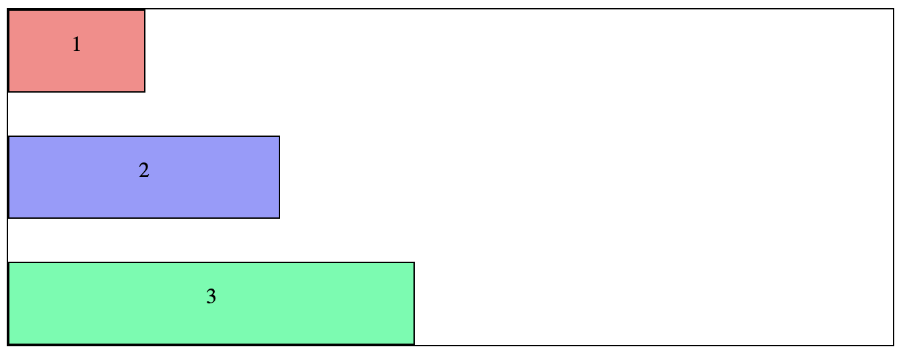

<code>justify-content: space-around</code>

space-around 跟上一個的差別就是 item 會被 space 包圍平分

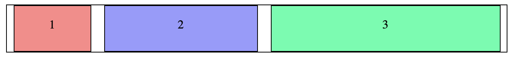


### align-items

這個屬性是用來設定垂直於主軸的“Cross axis”(交錯軸)，剛好是與 <code>flex-direction</code> 相反的。

```css
.container {
    align-items: flex-start | flex-end | center | stretch | baseline;
}
```
先以 <code>flex-direction: row</code> 為基礎來看，將 item 設定一下高度

```css
.item1{
    width: 100px;
    height: 50px;
    background: #FF8888;
}
.item2{
    width: 200px;
    height: 100px;
    background: #9999FF;
}
.item3{
    width: 300px;
    height: 150px;
    background: #33FFAA;
}
```

<code>align-items: flex-start </code>

此為預設的屬性，也就是在垂直(因為現在是 row，所以他的 cross axis 就會是垂直的)的部分會從開始點往下。

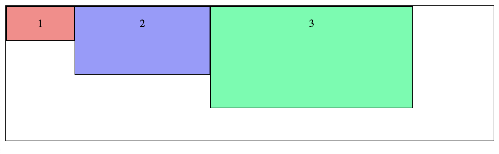

<code>align-items: flex-end </code>

也就是相對於前一個，從 end 開始

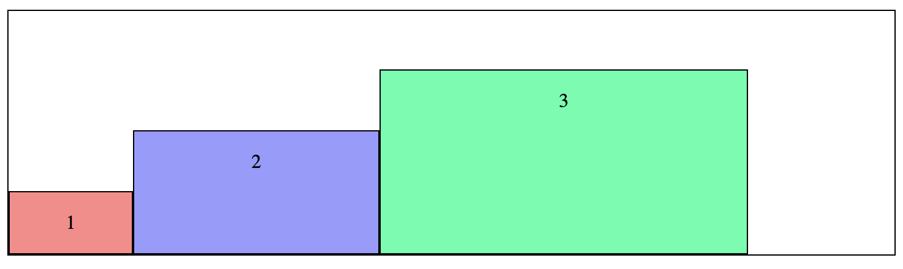

<code>align-items: center </code>

垂直至中

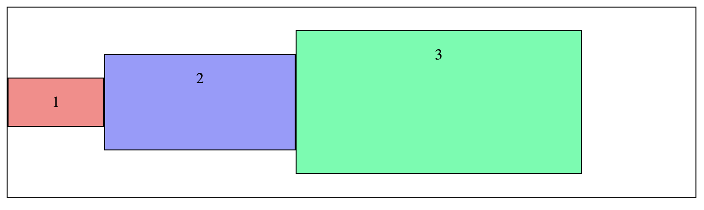

<code>align-items: stretch </code>

在 item 不設定自己的寬度 / 高度之下，這個屬性會將所有 item 撐到跟 container 一樣寬(高)

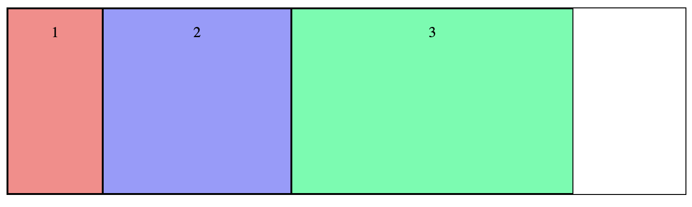


## Reference
* http://www.oxxostudio.tw/articles/201501/css-flexbox.html
* http://www.ruanyifeng.com/blog/2015/07/flex-grammar.html
* https://wcc723.github.io/css/2017/07/21/css-flex/
