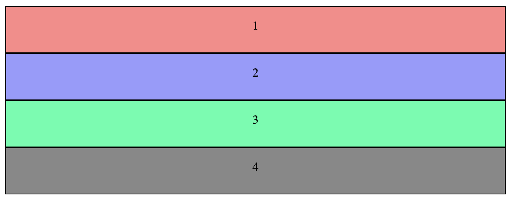

# CSS Flexbox

## Basic 

Flex 意為彈性的布局，舉例來說:

```css
.box {
    display: flex;
}

.box-inline {
    display: inline-flex;
}
```

外層會有一個 container (flex-container)，以及內部的 items (flex-item)

我們先將 container 設為一個 flex

```html
<div class="container">
    <div class="item item1">1</div>
    <div class="item item2">2</div>
    <div class="item item3">3</div>
    <div class="item item4">4</div>
</div>
```
css class setting

```css
.container {
    display: flex;
}
.item {
    border:1px solid #000;
    height: 60px;
    text-align: center;
    line-height: 50px;
}
.item1{
    width: 100px;
    background: #FF8888;
}
.item2{
    width: 200px;
    background: #9999FF;
}
.item3{
    width: 300px;
    background: #33FFAA;
}
.item4{
    width: 400px;
    background: #888888;
}
```

flex 會將畫面依照 item 的比例均分


但假如每個 item 沒有給予寬度，就會使用內容長度而已


## 外層 container 屬性

* flex-direction
* flex-wrap
* flex-flow
* justify-content
* align-items

### flex-direction
 
<code>flex-direction</code> 是用來控制主軸的方向，有四種設定可以調整，預設會是 <code>row</code> ，會是剛剛看到的排列方式。

```css
.container {
    flex-direction: row | row-reverse | column | column-reverse | inherit;
}
```

<code>flex-direction: row-reverse</code>


<code>flex-direction: column</code>

使用 column 的方式排列，每個 item 會是本來定義的大小


假如沒有定義寬度，那預設就會整個撐滿



<code>flex-direction: column-reverse</code>


### flex-wrap

這個屬性用來設定超出範圍的時候，需不需要換行。預設會是 <code>nowrap</code> ，這在最預設 row 的情況下會直接平分寬度，就不會是實際 item 的寬度。

```css
.container {
    flex-wrap: nowrap | wrap | wrap-reverse | inherit;
}
```

先以 <code>flex-direction: row</code> 為範例

<code>flex-wrap: nowrap</code>


<code>flex-wrap: wrap</code>

使用 wrap 的時候，會使用 item 實際的寬度，當超出範圍就會往下換行。


<code>flex-wrap: wrap-reverse</code>

一樣是會使用本來寬度，只是當超出範圍的時候會往"上"換行。


### flex-flow

即為 <code>flex-direction</code> + <code>flex-wrap</code>

用法：

```css
.container {
    flex-flow: {flex-direction} {flex-wrap};
}
```
以前面的例子舉例

```css
.container {
    display: flex;
    flex-direction: row;
    flex-wrap: wrap;
}
```

就可以寫成

```css
.container {
    display: flex;
    flex-flow: row wrap;
}
```


## Reference
* http://www.oxxostudio.tw/articles/201501/css-flexbox.html
* http://www.ruanyifeng.com/blog/2015/07/flex-grammar.html
* https://wcc723.github.io/css/2017/07/21/css-flex/
