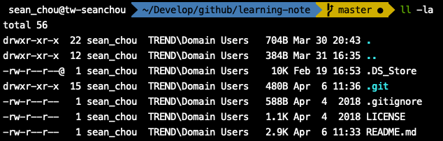
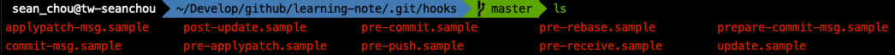

# Git Hooks

Hooks，為鉤子的意思。可以在 git action 執行前後 run your own script，常常會拿來做 unit test 檢查或是 linter 的 coding style 驗證。

## Install git hooks

預設在 git 目錄底下就會有 hooks 的檔案

由於 .git 是在隱藏目錄下，使用<code> $ ll -la </code>來顯示



接著只要進入 <code>.git/hooks</code> 底下就可以看到預設的 sample



## Use git hooks

當你只要修改了這些 .sample 檔案，把檔名換掉，git hooks 就會來執行這些檔案

舉例來說

我們去修改 <code>pre-push.sample</code> 裡面的 script，之後再把檔案從新命名為 <code>pre-push</code> ，這樣當你之後在執行 <code>$ git push</code> 之前，都會先來跑這隻 <code>pre-push</code> script。

因為只要 hooks 沒有 return 0 的時候，push action 就會失敗，所以 script 在實作上可能會寫成失敗 exit 1

```zsh
npm run test || {
    echo Pre-push fail
    exit 1
}
```

實務上不論前後端開發，常常會用來綁定 test / linter 來檢查 code，像是 <code>eslint</code>，<code>frontend unit test</code>，<code>PMD linter ckeck</code> 等等，目的讓團隊的 code 品質更好，預先減少很多錯誤的發生。

### Bypass git hook

當然還是有辦法可以避開 hooks 的檢查，只要在 git action 的時候下參數就可以 bypass git hooks。

<code>--no-verify</code>

```zsh
$ git push --no-verify
```

## Reference

* [Git Hooks Document](https://git-scm.com/book/zh-tw/v1/Git-%E5%AE%A2%E8%A3%BD%E5%8C%96-Git-Hooks)
