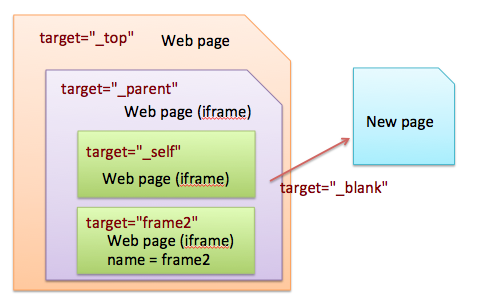

# HTML Learning Note

## HTML 5

HTML5更加語義化，使用有意義的tag來取代佈滿沒有意義的div
Ex: footer, nav

### script tag

HTML 5 新增了 defer & async 兩種新屬性

#### normal

一般情況的用法，遇到 script tag 時，web render 會停止，等 test.js 下載並且執行完，才會繼續執行下面的 HTML

```html
<script src="test.js" ></script>
```

#### defer

遇到 script tag 時，web render 不會停止，test.js 會在背景下載，等 DOMContentLoaded 再執行 test.js

```html
<script src="test.js" defer ></script>
```

遇到 script tag 時，web render 不會停止，test.js 會在背景下載

當 test.js 一下載完畢，會先停止 web render，並且執行 test.js

當 test.js 執行完畢，web render 才會繼續

```html
<script src="test.js" async ></script>
```

## viewport

簡單說是畫面可看到的範圍，分為兩種：

* display viewport
* actual viewport

為了讓網頁能在手機上瀏覽正常，通常會把actual viewport的值給visual viewport

```html
<meta name=”viewport” content=”width=device-width”>
```

設定寬度為320px

```html
<meta name="viewport" content="width="320">
```

設定寬度為裝置的寬度

```html
<meta name="viewport" content="width=device-width">
```

設定縮放大小為1倍

```html
<meta name="viewport" content="initial-scale=1">
```

設定縮放大小最大為1倍，但使用此設定，使用者會無法藉由放大縮小來看也面的內容

```html
<meta name="viewport" content="maximum-scale=1">
```

設定寬度為裝置的寬度、縮放大小為1倍

```html
<meta name="viewport" content="width=device-width,initial-scale=1">
```


## HTML target Attribute

* _blank    : Opens the linked document in a new window or tab
* _self     : Opens the linked document in the same frame as it was clicked (this is default)
* _parent   : Opens the linked document in the parent frame
* _top      : Opens the linked document in the full body of the window
* framename : Opens the linked document in a named frame



Demo page: [target-demo]

[target-demo]: <http://sean1093.github.io/demo/html-css-js/html-target-top.html>

 
## DOM

DOM: W3C所定義的文件物件模型 Document Object Module
當一個.html檔被以瀏覽器開啟的時候，瀏覽器就會去解析該檔案的DOM

### DOM 的效能

DOM 操作的效能主要 bottleneck is DOM repaint。

DOM 操作時常會伴隨 browser reflow，當DOM的內容變動，browser就需要持續去計算新的 layout 位置並 repaint

參考：https://www.andyteki.com/programming/2017/03/08/dom-insertion-performance.html


