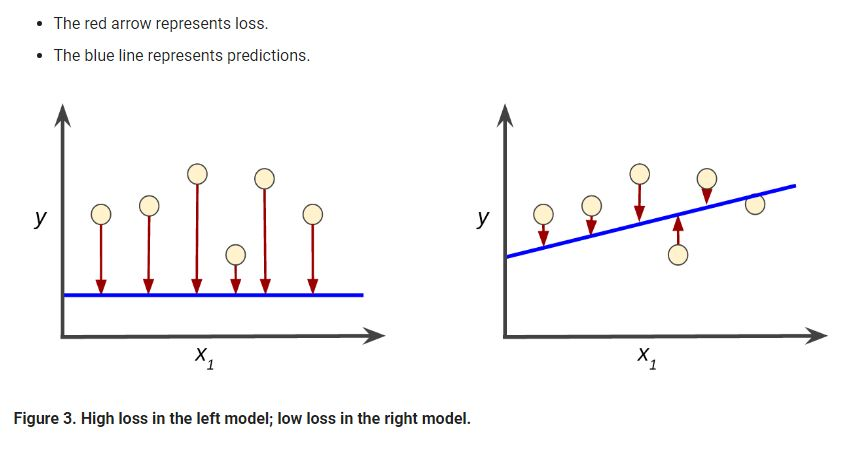

# Descending into ML

## Linear Regression

線性迴歸（linear regression）是在資料點中找出規律、畫出一條直線，可以建立一個簡易的方程式。

舉例來說: Chirps per Minute vs. Temperature in Celsius

可以大略畫出一條線來描述其資料分布

進而可以訂出一個方程式: y = mx + b

* y: 預測的結果 (label)
* m: 斜率    (the weight of feature 1)
* x: 資料輸入值 (feature)
* b: 起始值  (bias)

## Training and Loss

### Training a model

> Training a model simply means learning (determining) good values for all the weights and the bias from labeled examples.

Training model 就是一個從資料學習的過程，在 supervised learning 之中，會從很多的 example 中找到最小 loss 的 model，這個過程稱為  empirical risk minimization。

> loss is a number indicating how bad the model's prediction was on a single example.

### Loss function

Loss 是指在單一 example model 預測錯誤的部分，如果預測很準的話，loss = 0。因此，Training model 的目標就是要在所有 example 之中盡可能最小化 loss。

以下兩個不同的 model，左邊的 model 的 loss 就比較大，可得知右邊的 model 是比較好的

Loss function 是用來評估 model 預測值 f(x) 與真實 Y 的不一致程度，它是一个非負值函數，通常使用 L(Y, f(x)) 表示，損失函數越小，模型預測性就越好。

The squared loss for a single example 

= (observation - prediction(x))2

= (y - y')2

### MSE

均方根誤差 Mean square error (MSE) is the average squared loss per example over the whole dataset. 也就是所有損失函數的平均

