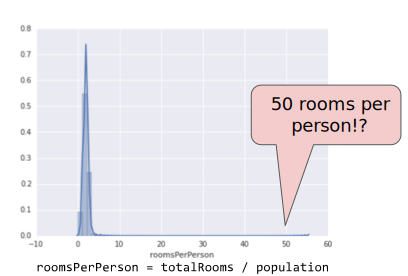
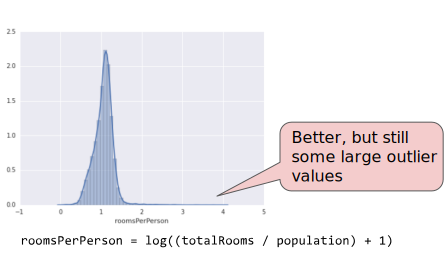
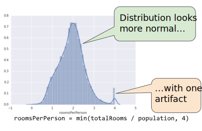

# Feature Engineering

Course link:

https://developers.google.com/machine-learning/crash-course/representation/video-lecture

## Mapping Raw Data to Features

>Feature engineering means transforming raw data into a feature vector.

在 ML 之中，feature engineering 是轉換 raw data 到 feature vector 的過程，並且會花上大量時間。

### Mapping numeric values

* _數字類的 feature_

很多 feature vector 必須要是 real-numbered vectors，因為在 machine learning models 中這些 feature value 必須要乘上 model weights。

因此所以資料是 integer or floating-point 可以不需要做 encoding。

### Mapping categorical values

* _類別類的 feature_

Categorical features 為離散類的資料，例如 <code>street_name</code>

```js
{'Charleston Road', 'North Shoreline Boulevard', 'Shorebird Way', 'Rengstorff Avenue'}
```

此時就必須要利用 feature engineering 來把 string 轉成 number

* Simple method

簡單直覺的方式是根據 vocabulary 來做 index。

map Charleston Road to 0
map North Shoreline Boulevard to 1
map Shorebird Way to 2
map Rengstorff Avenue to 3
map everything else (OOV) to 4

但這種方法會產生一些問題：

<strong>1. weighting 會有問題</strong>

we will multiply it by 0 for Charleston Road，如果我們要拿 street_name 來 predicts house prices ，這樣對於 price 並不會是一個線性的調整。

<strong>2. multiple values</strong>

當房子出現在兩條街的交叉口，會無法完整表現這個 feature

* One-hot encoding

比較好的做法是，建立一個 binary vector for each categorical feature 

比如說有四種 feature，就建立一個 <code>[0,0,0,0]</code>，當符合其中的 feature，就把相對應的值改成 <code>1</code>

Ex:

```js
// {'Charleston Road', 'North Shoreline Boulevard', 'Shorebird Way', 'Rengstorff Avenue'}
[0, 0, 0, 0]

// house 1 at Shorebird Way
[0, 0, 1, 0]

// house 2 at the corner of Charleston Road and Shorebird Way
[1, 0, 1, 0]
```

### Sparse Representation

但是當你有超過1000條road的時候，你建立的 binary vector 可能只有一個值用到，其他都是 0，這樣不僅浪費 storage 也浪費在 training 時候的 computation time。

因此會建議使用 Sparse Representation 的方法，只顯示有出現的值

https://developers.google.com/machine-learning/glossary/#sparse_representation

## Qualities of Good Features

<strong>_Avoid rarely used discrete feature values_</strong>

一個好的 feature values，至少會出現超過五次以上，舉例來說: 

* <code>house_type: victorian</code> 
就是一個好的 feature

* <code>unique_house_id</code> 
這種只會出現一次的就不會是一個好的 feature

<strong>_Prefer clear and obvious meanings_</strong>

feature 必須要有清楚明顯的意義，以 <code>house_age</code> 來說：

* <code>house_age: 27</code>
這就很明顯知道房屋年齡是27年

* <code>house_age: 851472000</code>
這種可能是 timestamp 格式的 age feature，就算雖然值是一樣的，但就不會是一個好的 feature

* <code>house_age: 277</code>
或是一些可能錯誤的 noisy data 也應該要去除掉

<strong>_Don't mix "magic" values with actual data_</strong>

常常習慣上，如果 user 沒有輸入資料會給予一個預設值或是替代值，這種在某些形況下的 feature 也是不好的，舉例來說：

quality_rating: 0.82
quality_rating: 0.37

// if a user didn't enter a quality_rating
quality_rating: -1

To work around magic values，可以把它拆成兩個 feature

1. 當有值的時候才紀錄 quality_rating
2. 多一個 boolean 的 feature 紀錄有 quality_rating or not

## Cleaning Data

### Scaling feature values

><strong>Scaling</strong> means converting floating-point feature values from their natural range (for example, 100 to 900) into a standard range (for example, 0 to 1 or -1 to +1).

Scaling 有點像是對資料做正規化的概念，把資料從本來可能很大的 range 縮小到一個標準的區間。

<strong>Scaling 的好處</strong>

* 加速 gradient descent converge
* 避免在 training 的時候因為超出 floating-point precision limit 而造成 NaN
* 可以幫助 model 對於每個 feature 學習 appropriate weights，減少 pay too much attention to the features having a wider range

<strong>How to Scaling data</strong>

$$ scaled value = (value - mean) / stddev. $$

舉例來說：

mean = 100
standard deviation = 20
original value = 130

scaled_value = (130 - 100) / 20
scaled_value = 1.5

### Handling extreme outliers

也必須要除去資料中的 extreme outliers，像是出現了 roomsPerPerson = 50，這種很大的極端值會影響到 model 的準確性



另一種做法可以對整個 data 取 log，並且把 outliers 做 clip





### Binning

將資料以區間來做分類，比如說像是經緯度的 floating-point value，這裡因為這個值不適合來當做 feature，因為 no linear relationship exists between latitude and housing values


### Scrubbing

還可能會遇到資料上的問題，如以下這幾種情況

>* Omitted values. For instance, a person forgot to enter a value for a house's age.
>* Duplicate examples. For example, a server mistakenly uploaded the same logs twice.
>* Bad labels. For instance, a person mislabeled a picture of an oak tree as a maple.
>* Bad feature values. For example, someone typed in an extra digit, or a thermometer was left out in the sun.

## Summary

1. 在 ML 過程中，training data 的品質是很重要的一件事，所以 Feature Engineering 是很重要又費時的一個階段。

2. 要把 raw data 換成 numeric values，也可以使用 One-hot encoding 來使得 feature 能被更好的描述

3. Raw data 需要做 Cleaning Data 的過程
a. Scaling 做正規化
b. 處理 extreme outliers
c. 將資料做 Binning
d. 把不適合的資料 Scrubbing
