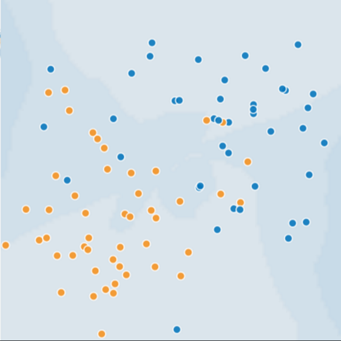
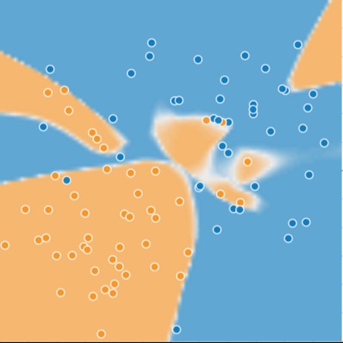
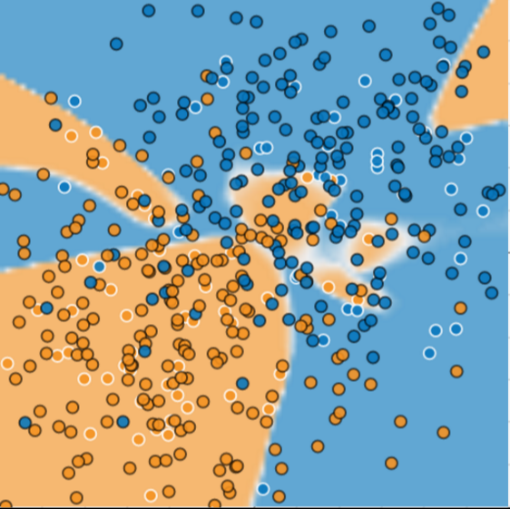

# Generalization: Peril of Overfitting

Course link:

https://developers.google.com/machine-learning/crash-course/generalization/video-lecture

## Overfits 

在面對資料的時候，主要目標希望能用 model 來描述預測資料，但 model 的複雜度就是一個關鍵因素。

舉例如以下的 data set

假如想要完美的描述所有 data set 中的資料，可以建立一個複雜的 model

> Low loss, but still a bad model?

但是，當有新的 data 出現時，這個 model 很難描述新的資料

* overfits

這個現象稱為這個 model overfits ，這個 model 沒辦法預測新的資料，只能適合 sample data而已

> 在統計學中，過適（英語：overfitting，或稱過度擬合）現象是指在調適一個統計模型時，使用過多參數。

reference: https://zh.wikipedia.org/wiki/%E9%81%8E%E9%81%A9

* Ockham's razor 奧坎的剃刀理論

> 如果關於同一個問題有許多種理論，每一種都能作出同樣準確的預言，那麼應該挑選其中使用假定最少的。儘管越複雜的方法通常能做出越好的預言，但是在不考慮預言能力（即結果大致相同）的情況下，假設越少越好。

reference: https://zh.wikipedia.org/wiki/%E5%A5%A5%E5%8D%A1%E5%A7%86%E5%89%83%E5%88%80

## training and testing

A machine learning model aims to make good predictions on new, previously unseen data.

machine learning model 最主要的目的是想要預測還沒出現過的 data，因此會採用 subsets 的方式，將目標的 data set 以同一種方式分為以下兩個 subsets

* training set: a subset to train a model.
* test set: a subset to test the model.

假設是

* The test set is large enough.
* You don't cheat by using the same test set over and over.

### basic assumptions guide generalization

1. 使用獨立且一致的方式抽取樣本

2. 資料分布平穩，不會隨著時間有大波動出現

3. 從同一個 data set 抽取樣本

