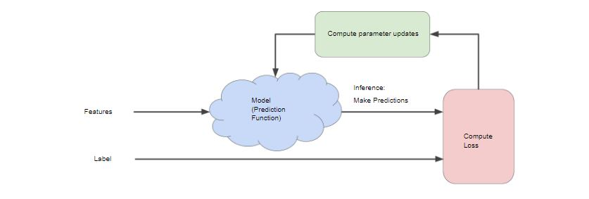
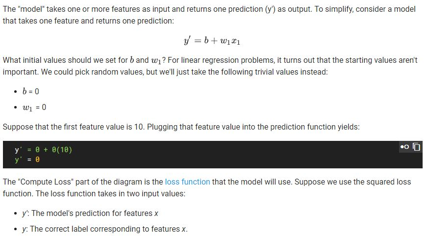
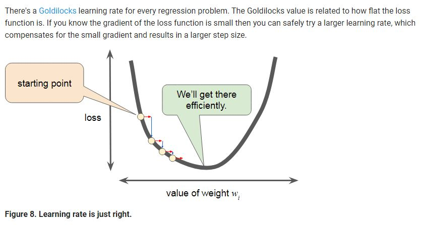

# Reducing Loss

Course link:

https://developers.google.com/machine-learning/crash-course/reducing-loss/video-lecture

## Iterative learning

最顯而易見的就是 trial-and-error process，像是猜數字遊戲，一開始是一個 wild guess ，在每一回合得知 loss 之後去修正下一次的猜測。

在 ml 之中，利用 trial-and-error process 來 train model 就像以下這個圖: (An iterative approach to training a model.) 把 feature 餵進去 model (Prediction Function) 來得到 pridiction 之後，透過 label 來計算 loss 並回來修正 model 參數

在 linear regression 中，一開始的 starting values aren't important => make a wild guess

1. 一開始 b & 參數 w 皆可為 0
2. 當給予第一個 feature value 的時候就可以得到當下的 pridiction y
3. 再使用真正的 label y 來跟我們的 pridiction 計算出 loss，如此就可以回推調整參數
4. 每次的 feature 可能都會計算出不同的參數，model 要藉由不斷調整參數來找出可以達到最小loss的參數
5. 不斷的 re-evaluates all those features against all those labels
6. 最後就可以稱為這個 model converged

## Gradient Descent

> 梯度下降法（Gradient descent）是一個一階最佳化算法，通常也稱為最速下降法。 要使用梯度下降法找到一個函數的局部極小值，必須向函數上當前點對應梯度（或者是近似梯度）的反方向的規定步長距離點進行疊代搜索。如果相反地向梯度正方向疊代進行搜索，則會接近函數的局部極大值點；這個過程則被稱為梯度上升法。
> from wiki

可參考: https://medium.com/@ken90242/machine-learning%E5%AD%B8%E7%BF%92%E6%97%A5%E8%A8%98-coursera%E7%AF%87-week-1-3-parameter-9273f86c5613

> The gradient descent algorithm takes a step in the direction of the negative gradient in order to reduce loss as quickly as possible

* 往負向的 gradient 前進
* 斜率的部分會因為越靠近最佳解，而斜率的絕對值將會越來越小
* step 過大時，雖然降低 loss 速度快，但有可能會永遠找不到 minium
* step 過小時，降低 loss 速度過慢

### Batch Gradient Descent 

將所有資料都下去做 training。(the batch has been the entire data set)

問題: A very large batch may cause even a single iteration to take a very long time to compute.

### Stochastic gradient descent

在資料量很大的時候，Gradient Descent 會造成 training 時間過長，且 data set 中可能會有很多重複的資料，這時候就會使用 Stochastic gradient descent (SGD)，簡單來說就是在 data set 中取出一部分的 sample data set 來做 training。
