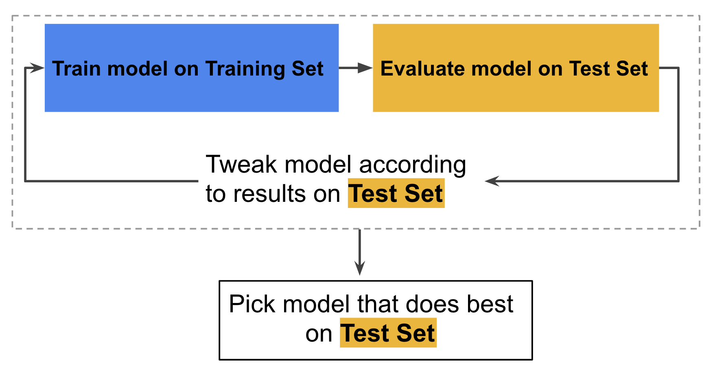
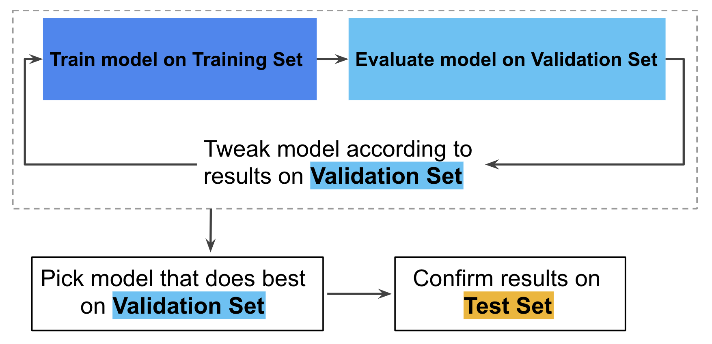

# Splitting data and validation

Course link:

https://developers.google.com/machine-learning/crash-course/training-and-test-sets/video-lecture
https://developers.google.com/machine-learning/crash-course/validation/video-lecture

## Splitting Data

test set 有兩個重要的條件

* Is large enough to yield statistically meaningful results.
* Is representative of the data set as a whole. In other words, don't pick a test set with different characteristics than the training set.

### Never train on test data

training set 跟 testing set 一定要分開。

### overfitting

有的時候，做越多次的 evaluate ，反而越有可能會 overfitting

The more often we evaluate on a given test set, the more we are at risk for implicitly overfitting to that one test set. 

## Partition

在之前幾章學到的流程

1) 透過不斷在 training set 上 train model

2) 將這個 model 進入 test set ，根據 result 驗證並作修改 (Tweak model: 改變 learning rate，增減 features 等等)

3) 持續重複這個流程來找出“最符合” test set 的 model

但這會有 overfitting 的可能性

因此，為了降低這個可能性，可增加 Validation Set

使用 Validation Set 來評估 training set 的 result，再用 test set 做 doule check

In this improved workflow:

1. Pick the model that does best on the validation set.

2. Double-check that model against the test set.