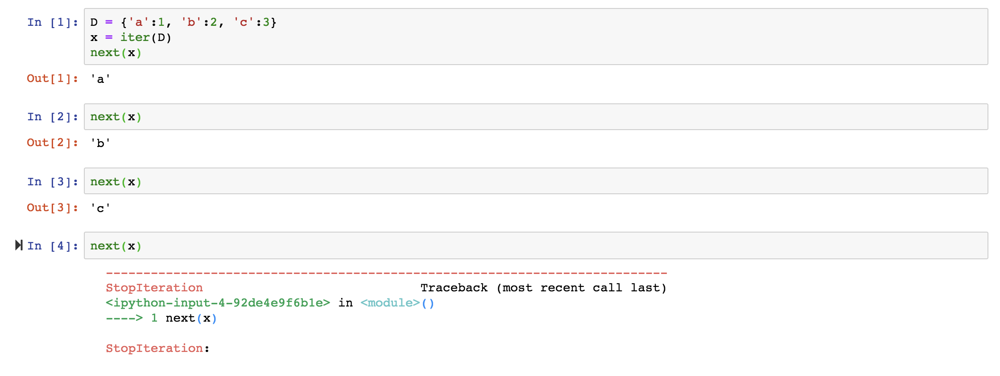

# Python basic knowledge 2

## List comprehensions

> list comprehensions allow you to create lists with a for loop with less code.

可以在 list 中使用 for 迴圈的一種方式

```python
>>> comp_list = [x * 2 for x in range(10)] 
>>> print(comp_list)
[0, 2, 4, 6, 8, 10, 12, 14, 16, 18]


>>> comp_list_2 = [x ** 2 for x in range(7) if x % 2 == 0] 
>>> print(comp_list_2)
[4, 16, 36]
```


## Map, Filter and Reduce


## Iterable, Iterator and Generator

### Iterable and Iterator

> Iterable is a “sequence” of data, you can iterate over using a loop.

Iterable 指的是 a “sequence” of data，也就是可以透過 loop 來遍尋。例如 list 就是一個 Iterable 物件，其他還有  strings, dicts, tuples, sets

這些物件中都含有 <code>iter()</code> method ，可以透過 <code>hasattr()</code> 來檢查

```python
>>> hasattr(str, '__iter__')
True  
>>> hasattr(bool, '__iter__')
False
```

* iter a dicts




### Generator

> In Python, generators provide a convenient way to implement the iterator protocol. Generator is an iterable created using a function with a yield statement.

Generator 就是利用 yield 把 function 變成 iterable，回傳值是一個 generator object

#### yield

yield 跟 return 很像，只是 return 的時候 function call stack 會被清掉，下一次再 call 會重新來。yield 則是下次呼叫時，可以從上次還未執行到的部分繼續執行，而不是重新建立一個新 stack。

可以使用 next & send

* next

```python
def yield_function():
    i = 0
    yield i
    i = 1
    yield i
     
generator = yield_function()
print generator.next()
print ('restart')
print generator.next()
```

會印出

```zsh
0
restart
1
```

或是使用變數去接 yield

```python
def yield_function():
    i = 0
    a = yield i
    i = 1
    yield a
     
generator = yield_function()
print generator.next()
print ('restart')
print generator.next()
```

會印出

```zsh
0
restart
none
```

* send

可以從呼叫 function 的地方得到參數帶入 yield

```python
def yield_function():
    i = 0
    a = yield i
    i = 1
    yield a
     
generator = yield_function()
print generator.next()
print ('restart')
print generator.send(8)
```

會印出

```zsh
0
restart
8
```

* generator function output

generator function 會回傳 generator object，需要用 list 轉換

```python
def scramble(seq):
    for i in range(len(seq)):
        yield seq[i:] + seq[:i]

>>> scramble('spam')
<generator object scramble at 0x10a017db0>
>>> list(scramble('spam'))
['spam', 'pams', 'amsp', 'mspa']
```


## scope & LEGB

https://segmentfault.com/a/1190000000640834

## reference
* http://www.runoob.com/python3/python3-tutorial.html
* https://openhome.cc/Gossip/CodeData/PythonTutorial/index.html
* https://github.com/qiwsir/ITArticles/blob/master/BasicPython/index.md

https://medium.freecodecamp.org/python-list-comprehensions-vs-generator-expressions-cef70ccb49db