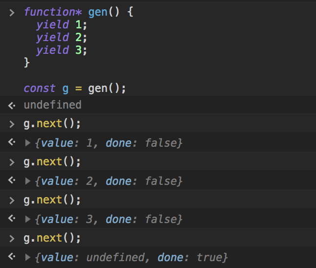

# Iterators and Generators

http://www.typescriptlang.org/docs/handbook/iterators-and-generators.html

TypeScript 2.3 adds full support for generators and the Iterator

https://www.typescriptlang.org/docs/handbook/release-notes/typescript-2-3.html

## Iterator and Iterables

https://developer.mozilla.org/zh-TW/docs/Web/JavaScript/Reference/Iteration_protocols

> In order to be iterable, an object must implement the @@iterator method, meaning that the object (or one of the objects up its prototype chain) must have a property with a @@iterator key which is available via constant Symbol.iterator

iterable， 允許 JavaScript 物件定義或客制他們的迭代行為。例如哪些值可在 for..of 語法結構中被迭代出來。

* Default is an iterable object:
    * Array
    * Map
    * Set
    * String

## for..of statements

> <code>for..of</code> loops over an iterable object, invoking the Symbol.iterator property on the object.

印出 target iterable object 的 value

```js
let someArray = [1, "string", false];

for (let entry of someArray) {
    console.log(entry); // 1, "string", false
}
```

### <code>for..of</code> compile result

```js
let numbers = [1, 2, 3];
for (let num of numbers) {
    console.log(num);
}
```

```js
var numbers = [1, 2, 3];
for (var _i = 0; _i < numbers.length; _i++) {
    var num = numbers[_i];
    console.log(num);
}
```

## for..of vs. for..in statements

> <code>for..in</code> returns a list of keys on the object being iterated, whereas <code>for..of</code> returns a list of values of the numeric properties of the object being iterated.

<code>for..in</code> 回傳 key

<code>for..of</code> 回傳 value


```js
let list = [4, 5, 6];

for (let i in list) {
   console.log(i); // "0", "1", "2",
}

for (let i of list) {
   console.log(i); // "4", "5", "6"
}
```

> <code>for..in</code> operates on any object; it serves as a way to inspect properties on <strong>this object</strong>. <code>for..of</code> on the other hand, is mainly interested in values of <strong>iterable objects</strong>.

```js
let pets = new Set(["Cat", "Dog", "Hamster"]);
pets["species"] = "mammals";

for (let pet in pets) {
   console.log(pet); // "species"
}

for (let pet of pets) {
    console.log(pet); // "Cat", "Dog", "Hamster"
}
```

<code>for..in</code> 專注於這個物件

<code>for..of</code> 專注於 iterable objects


## What is generator

> The Generator object is returned by a generator function and it conforms to both the iterable protocol and the iterator protocol.

Generator 是 ES6 之後提供的一種 asynchronous 的解決方案。

Generator function 可以視為一種狀態機，封裝了多個內部狀態。

### How to use generator

* star between function keyword and name
* use yield to define different state

```js
function* gen() { 
  yield 1;
  yield 2;
  yield 3;
}

const g = gen(); // "Generator { }"
```

Generator 是分段執行，<code>yield</code> 是暫停的標誌，而 <code>next</code> 方法可以恢復執行。

使用的時候利用 <code>next</code> function，來使指針一到下一個 狀態 (yield 的位置)，會回傳一個包含 value & done 兩個屬性的 object

* value: 為此狀態的值
* done: 會回傳這個 generator 結束與否 (true / false)

當執行遇到 yield 表達式，就暫停執行後面的操作，並將緊跟在 yield 後面的那個表達式的值，作為返回的對象的 value 屬性值

直到所有直都走完後，最後會回傳 <code>{value: undefined, done: true}</code> 代表結束

```js
g.next();
> {value: 1, done: false}
g.next();
> {value: 2, done: false}
g.next();
> {value: 3, done: false}
g.next();
> {value: undefined, done: true}
```




## Reference

http://es6.ruanyifeng.com/#docs/generator
