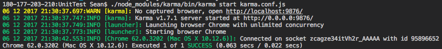
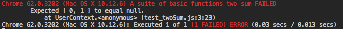

# Unit Test for JavaScript

使用 karma 與 jasmine 

sample: https://github.com/sean1093/learning-note/tree/master/sample/unit-test/karma

## 安裝步驟

```sh
// 1. 先建立 package.json
npm init

// 安裝 karma
npm install karma --save-dev

// 安裝必要的其它套件
npm install karma-jasmine karma-chrome-launcher jasmine-core --save-dev
```

此時可以使用start 來看看有沒有安裝成功

```sh
./node_modules/karma/bin/karma start
```

建立 inital 檔案

```sh
./node_modules/karma/bin/karma init
```

## 執行步驟

再來就是要做 unit test 的檔案了，這裡拿 leetcode 01. Two Sum 來作要測試的目標 function

首先建立一個包含 twoSum 這個 function 的 twoSum.js ，和一個測試用的檔案 test_twoSum.js

* 使用 describe 為一個測試單元
* expect / toEqual 來跑 test

```js
describe("A suite of basic functions", function() {
    it("two sum",function(){
       expect([0, 1]).toEqual(twoSum([2, 7, 11, 15], 9));
    });
});
```

接著要把 karma.conf.js 裡面稍做修改

```js
...
    // list of files / patterns to load in the browser
    files: [ '*.js'
    ],
    // list of files to exclude
    exclude: [ 'karma.conf.js'
    ],
...
```

之後使用 start 就可以 run 了

```sh
./node_modules/karma/bin/karma start karma.conf.js
```

成功與失敗分別會看到以下結果

* success



* failed

